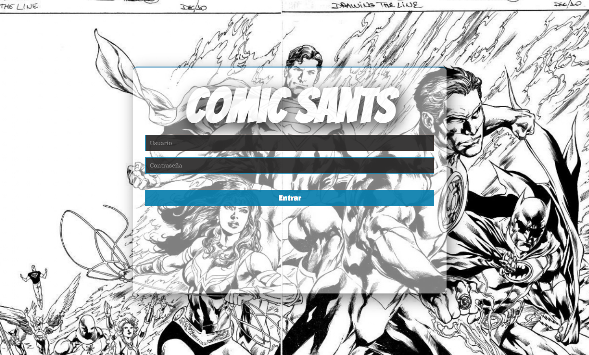

# ComicSants 🦸‍♂️🦸‍♀️

> **ComicSants** is a comprehensive internal management application designed for hobby stores. It facilitates stock management, sales processing, invoice generation, and statistical analysis of sales data.

## 📖 Overview

Built with Node.js, Express, and SQLite, this application serves as a Point of Sale (POS) and inventory system. It allows store administrators to track products ranging from Comics and Snacks to Board Games and Trading Cards.

## ✨ Key Features

*   **🛒 Point of Sale (POS):**
    *   Interactive cart management for multiple product categories.
    *   Real-time total calculation.
    *   **Invoice Generation:** Automatically creates and prints formatted invoices for customers.
*   **📦 Inventory Management:**
    *   CRUD operations for **Snacks**, **Comics**, **Board Games** (Tables), and **Trading Cards** (Cards).
*   **📊 Analytics Dashboard:**
    *   Integrated **Google Charts** to visualize sales data.
    *   Breakdown of sales by product category (Pie Charts and Tables).
*   **👥 Client & Admin System:**
    *   Admin authentication for secure access.
    *   Client association with sales orders.

## 🛠️ Tech Stack

*   **Frontend:** HTML5, CSS3, JavaScript (Vanilla ES6+), Google Charts API.
*   **Backend:** Node.js, Express.js.
*   **Database:** SQLite (better-sqlite3) - Local, file-based database.
*   **Tools:** Git, Visual Studio Code.

## 📸 Preview

<div align="center">
  
</div>

## 🚀 Getting Started

### Prerequisites

- Node.js (v14 or higher)
- npm (comes with Node.js)

### Installation

1.  **Clone the repository:**
    ```bash
    git clone https://github.com/enekomb/ComicSants.git
    cd ComicSants
    ```

2.  **Install dependencies:**
    ```bash
    npm install
    ```

3.  **Initialize Database:**
    The SQLite database will be automatically created on first run. To create an admin user for login:
    ```bash
    # Install SQLite CLI if you don't have it
    # On Ubuntu/Debian: sudo apt install sqlite3
    # On macOS: brew install sqlite3
    
    # Connect to database
    sqlite3 database/comicsants.db
    
    # Create admin user (run this in SQLite prompt)
    INSERT INTO admins (username, password) VALUES ('admin', 'admin123');
    
    # Exit SQLite
    .exit
    ```

4.  **Run the server:**
    ```bash
    npm start
    ```
    
    For development with auto-reload:
    ```bash
    npm run dev
    ```

5.  **Open in Browser:**
    *   Visit `http://localhost:3000`
    *   Login with username: `admin`, password: `admin123`
    *   **Important:** Change the default password after first login!

## 📁 Project Structure

```
ComicSants/
├── database/
│   ├── connection.js      # SQLite connection and initialization
│   ├── schema.sql         # Database schema definition
│   └── comicsants.db      # SQLite database file (auto-generated)
├── routes/
│   ├── admins.js          # Admin authentication routes
│   ├── cards.js           # Trading cards CRUD routes
│   ├── clients.js         # Client management routes
│   ├── comics.js          # Comics CRUD routes
│   ├── products.js        # General products routes
│   ├── sales.js           # Sales and reporting routes
│   ├── snacks.js          # Snacks CRUD routes
│   └── tables.js          # Board games CRUD routes
├── public/
│   ├── catalog/           # Product catalog view
│   ├── home/              # Home dashboard
│   ├── manage/            # Product management interface
│   ├── reports/           # Sales analytics and reports
│   ├── sales/             # Point of Sale interface
│   └── index.html         # Login page
├── index.js               # Main application entry point
├── package.json           # Project dependencies
├── DEPLOYMENT.md          # Deployment guide for free hosting
└── README.md              # This file
```

## 🗄️ Database Schema

The application uses SQLite with the following tables:

- **admins** - Admin users for authentication
- **clients** - Customer information
- **comics** - Comic books inventory
- **snacks** - Snacks inventory
- **cards** - Trading cards inventory
- **tables** - Board games inventory
- **sales** - Sales transactions and history

See `database/schema.sql` for the complete schema definition.

## 🚢 Deployment

For detailed deployment instructions on free hosting platforms (Railway, Render, etc.), see [DEPLOYMENT.md](./DEPLOYMENT.md).

### Quick Deploy Options:

- **Railway** (Recommended): [See Deployment Guide](./DEPLOYMENT.md#option-1-railway-recommended-for-sqlite)
- **Render**: [See Deployment Guide](./DEPLOYMENT.md#option-2-render)
- **Self-Hosted VPS**: [See Deployment Guide](./DEPLOYMENT.md#option-4-self-hosted-vps-digitalocean-linode-aws-ec2)

## 🔒 Security Notes

- Change the default admin password immediately after setup
- Passwords are securely hashed using bcrypt with 10 salt rounds
- Set up HTTPS in production environments
- Regular backups of the SQLite database are recommended
- Consider implementing session management or JWT for production authentication

## 🛠️ Development

### Available Scripts

- `npm start` - Start the production server
- `npm run dev` - Start development server with auto-reload (nodemon)

### Adding New Products

1. Navigate to the "Manage" section
2. Select the product category (Comics, Cards, Board Games, Snacks)
3. Fill in the product details
4. Click "Add" to save

### Making Sales

1. Navigate to the "Sales" section
2. Select customer (optional)
3. Add products to cart by selecting from dropdowns
4. Review total
5. Complete sale to generate invoice

### Viewing Reports

1. Navigate to the "Reports" section
2. View sales breakdown by category
3. Interactive charts show sales distribution

## 📝 Migration Notes

This project has been migrated from MongoDB to SQLite for easier deployment and local operation. Key changes include:

- Replaced MongoDB/Mongoose with better-sqlite3
- Converted all async MongoDB operations to synchronous SQLite queries
- Maintained all original functionality
- Translated all folder names, files, and UI elements from Spanish to English

## ✒️ Authors

*   **Alex Uriarte** - uriuriarte
*   **Mael Munuera** - MMCX55
*   **Eneko Muñoz** - enekomb

## 📄 License

ISC

## 🤝 Contributing

Contributions, issues, and feature requests are welcome! Feel free to check [issues page](https://github.com/enekomb/ComicSants/issues).

---

<div align="center">
  <sub>Built with ❤️ by the ComicSants Team</sub>
</div>
